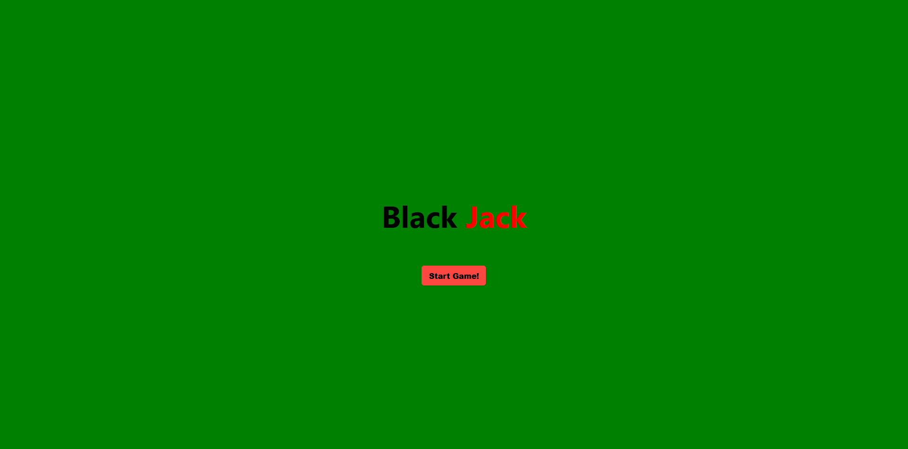
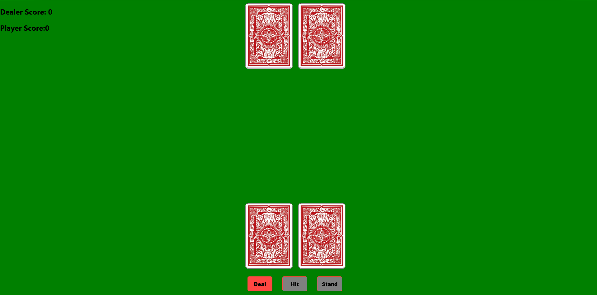
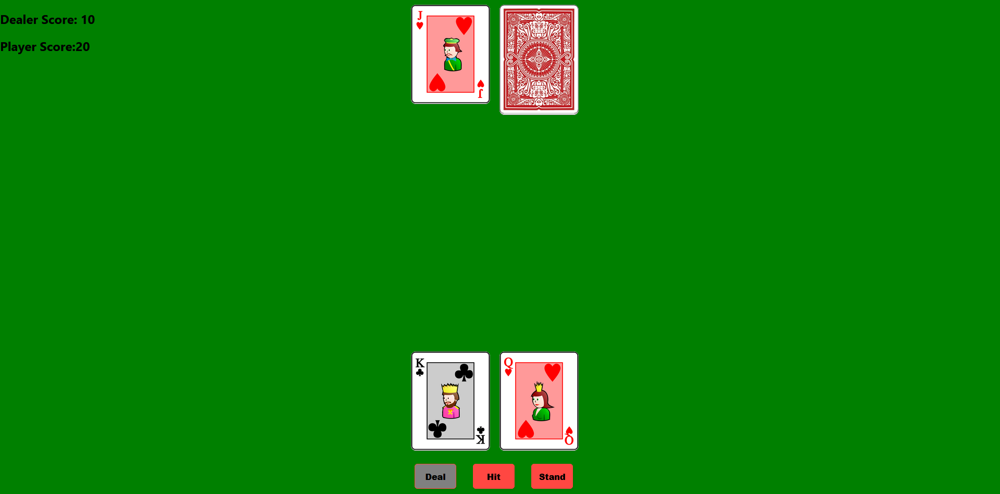
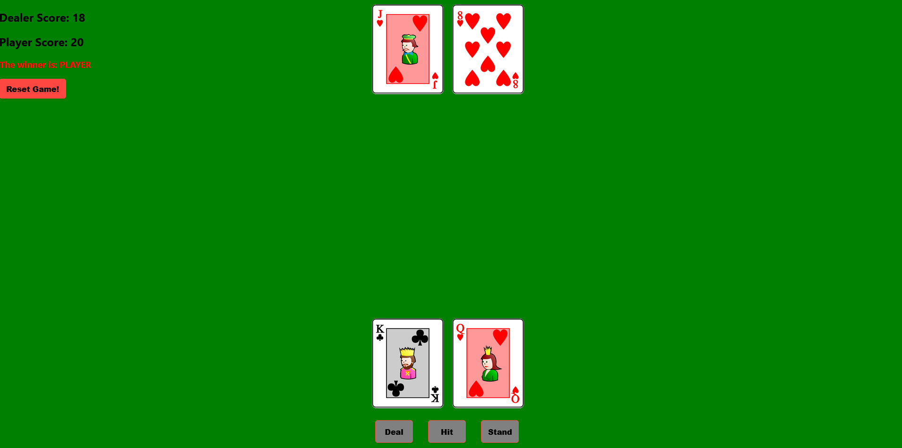
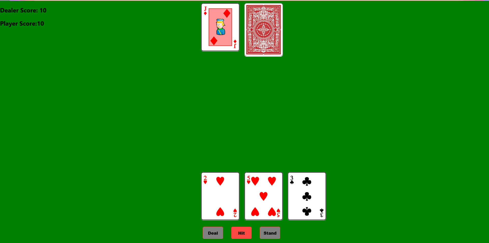
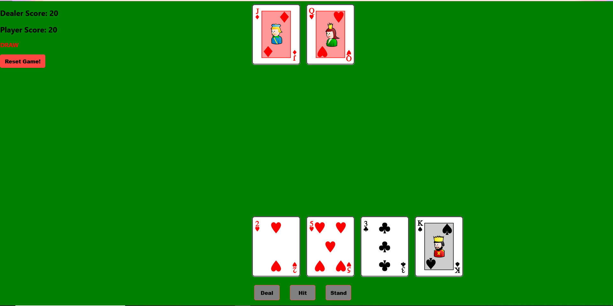
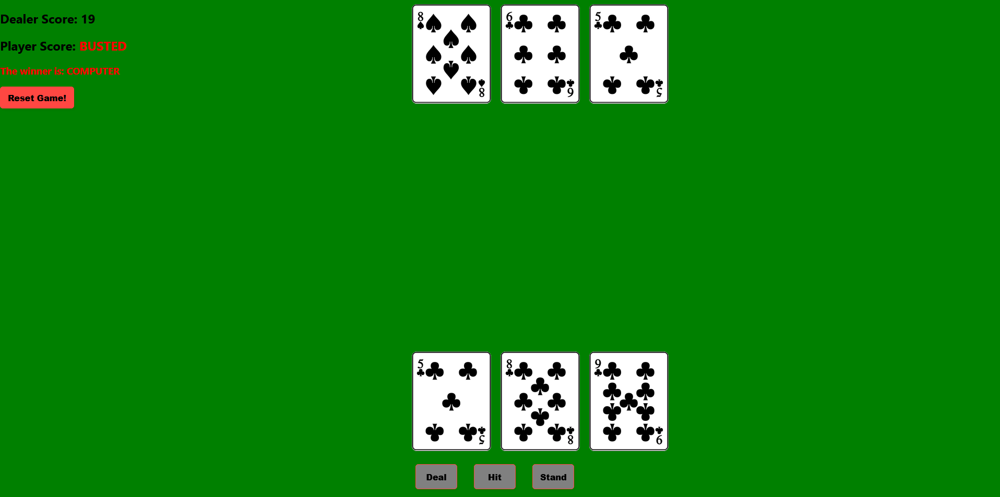

# BlackJackReact-Compete With Computer In A BlackJack Game

# Website Address (Hosted By Vercel)
https://blackjack-reactjs.vercel.app/

# How To Start:

    1. Clone this project
    2. Run 'npm install'
    3. Run 'npm start'
    
# Languages:

    1. Front-end: ReactJS, HTML
    2. State Changing: React Context
    3  Styles: Native Module CSS
    4. Main Language: Javascript

# Usage:

    1. User can deal, hit or stand while competing to the computer
    2. Has all possibilities win, lose or tie case
    3. Prevent standing while do not have enough point (17) && computer will automatical draw more card when does not have enough point
    4. Has 3 different ways to calculate an A(1, 10, 11) in blackjack

# Showcase:

## Landing Page

## Begin Phase

## In Round Phase

## Announce Winner

## Not Allow To Stand Phase

## Draw Case

## Busted Case

